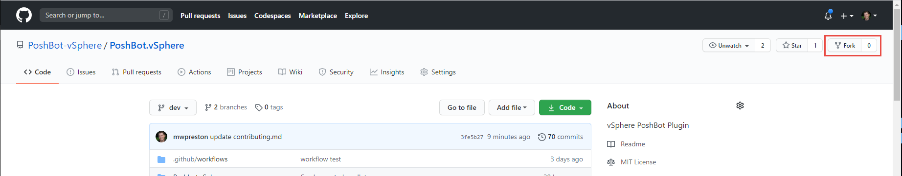
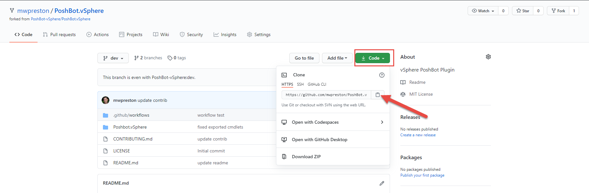

# Contributing to the PoshBot.vSphere Plugin
We are so happy you are willing to help! Honestly, whether it's code related (new commands, code fixes, enhancements, bugs) or even non-code contributions (documentation, spelling, videos, localization) we will 100% accept the help!  Also - we are here to help.  This is a great project that was born out of the VMware {Code} 2020 Hackathon.  Hackathons promote learning and we intend to keep it that way. This is a great project to start to get used to things like forking and pull requests - reach out if you have any questions at all.

***Note*** The dev branch is the main working branch on this repo - it's where you will find all of the new features, functionality, and bug fixes. You can only submit Pull Requests to the dev branch.  Master is protected and will only be updated when we deem enough functionality to warrant a new release to the PowerShell Gallery.

The PoshBot.vSphere plugin follows the GitHub flow methodology.  Basically, fork the repository, pull it down local, create a branch (based off dev), commit some changes, push to back to your forked copy, and issue a Pull Request.  We will review and merge!  It's as easy as that!

If you know exactly what's happening - go ahead and contribute away - if you need a little push, let me walk you through a common scenario of creating a new command...

## Common Scenario for creating a new PoshBot.vSphere command
1. First things first, you will need to fork this repo to your own GitHub account.
This part is easy, and completely GUI based.  Head to this repositories [landing page](https://github.com/PoshBot-vSphere/PoshBot.vSphere).  See that cool little `Fork` option in the top right hand corner - yeah, click it!

Select your username from the list - way to go, you now have a forked copy of the project in your own GitHub account.
2. Grab your forked URI
Head on over to your GitHub account, and find the newly forked repository.  Select the `Code` button, then click the little `copy` icon next to the URI containing the address to your repo!  You will need this for the next step when we clone the repo locally!

3. Create a new directory (locally) and clone the repository.
Here's some code, replace ***URI_FROM_STEP_2*** with, well, the URI you copied in step 2 :)
```
mkdir c:\pb
cd c:\pb
git clone URI_FROM_STEP_2
```
4. Create new branch based off of `dev`. I usually name these with my initials, then sort of what will be included in the branch.
```
git checkout dev
git checkout -b mwp-vmpowerstatus
```
5. You can make sure you are on your feature branch by issuing
```
git branch
```
6. Do your thang!
Go ahead and do some work!  Create some awesome commands, fix some buggy ones, make our documentation more clear!

If there are new files you need to add with
```
git add .
```
and then commit
```
git commit -a -m 'commit message'
```
Do this as many times as you see fit!
7. Push your masterpiece back up to your repo
When you are all done with your awesomeness, give your code a push back up to your repo on GitHub.
```
git push --set-upstream origin <branchname>
IE
git push --set-upstream origin mwp-updatingstuff
```
If you have already done the whole `set-upstream` business, then you can get by with a simple `git push`
8. Go to your repo and issue a new Pull Request, based off of your branch
```
Pull Requests-> New Pull Request
Use Poshbot.vSphere/PoshBot.vSphere and dev as base, and your repo and branch as compare
Click 'Create Pull Request'
You can add a little description around what is changed/added. This will help things move along faster
Tag me as a reviewer if you want...  Otherwise I will just watch the repo
Click 'Pull Request'
```
9. Thats it, I'll go in and review and approve and merge!  Done!
Thank you so much for your contribution!  You are a good person!

